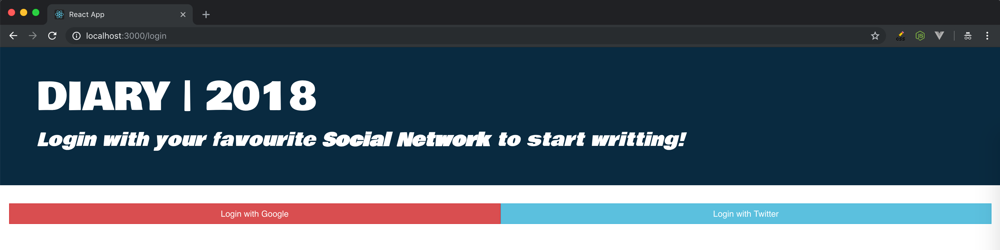
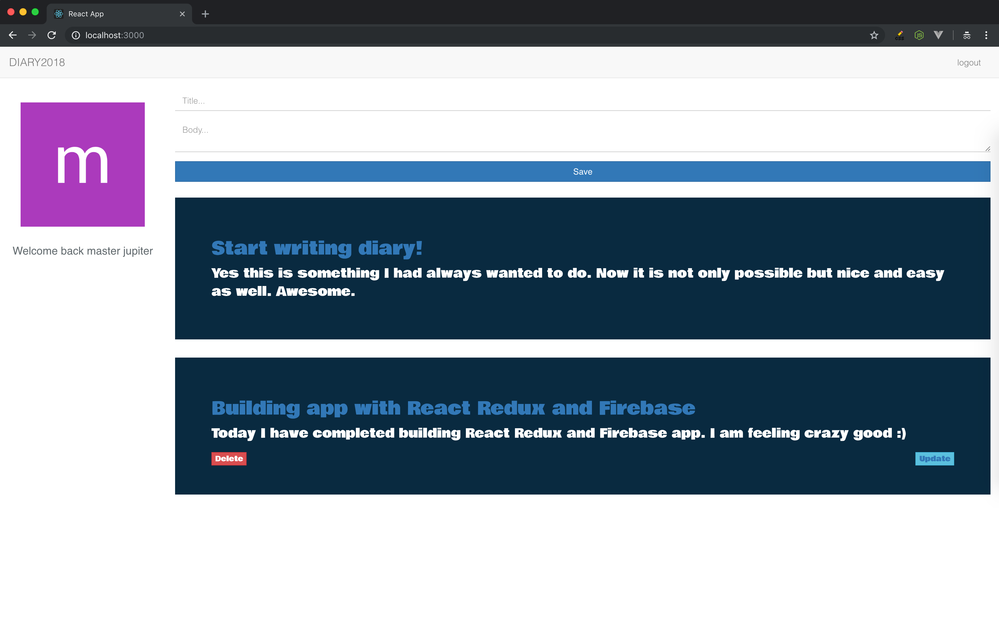
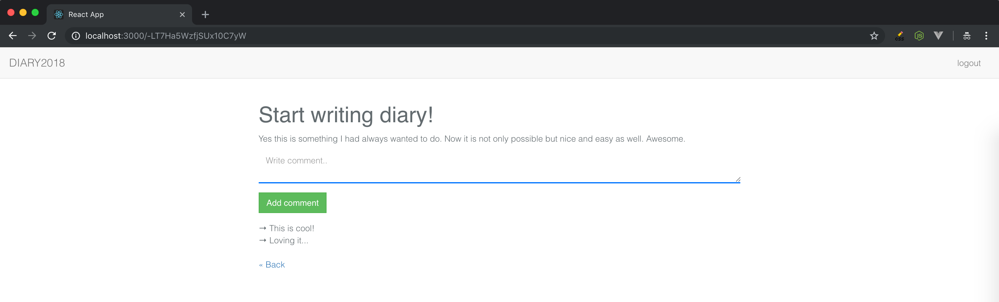

## React Redux Firebase CRUD app with Authentication and Commenting System

Update firebase credentials in /src/firebase.example.js then rename to just firebase.js

## Live demo:

[React Redux Firebase CRUD app with Auth and Comments](https://react-diaryapp.firebaseapp.com)

## App Screenshots

